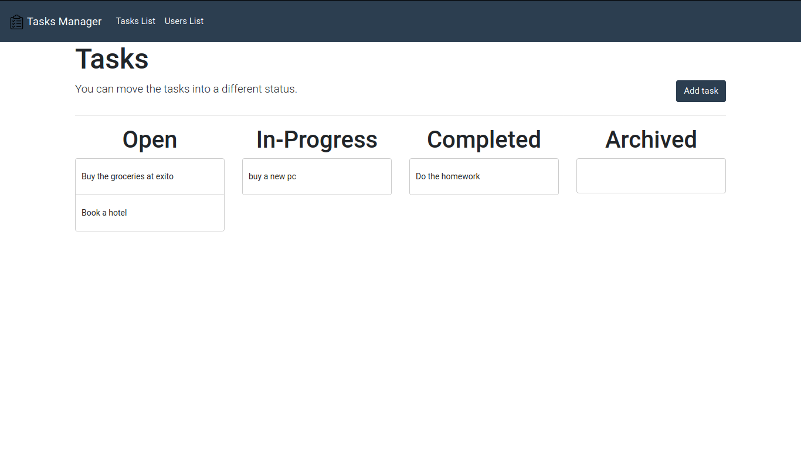
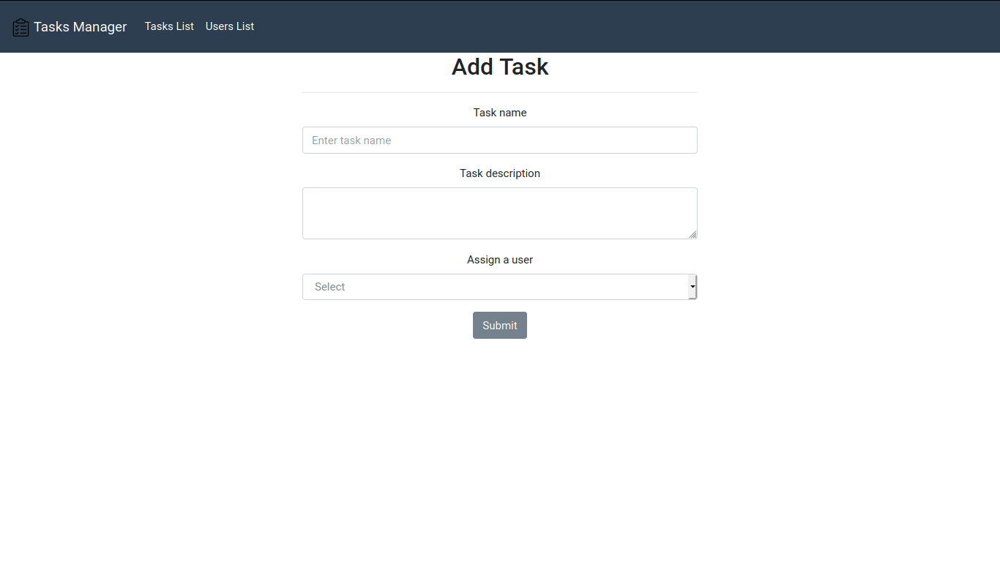
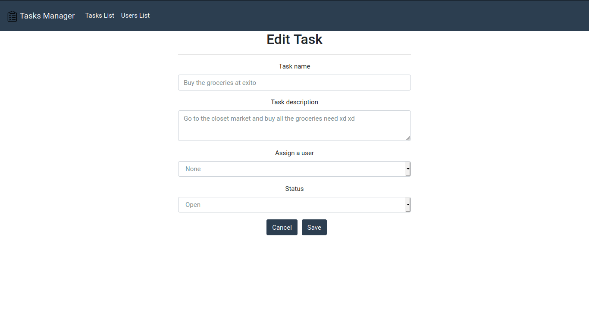
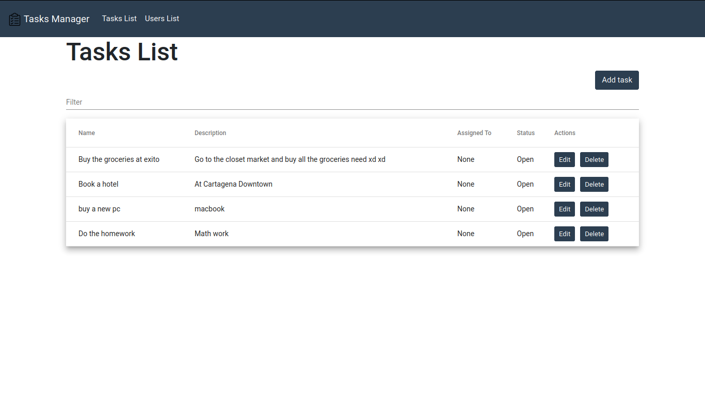
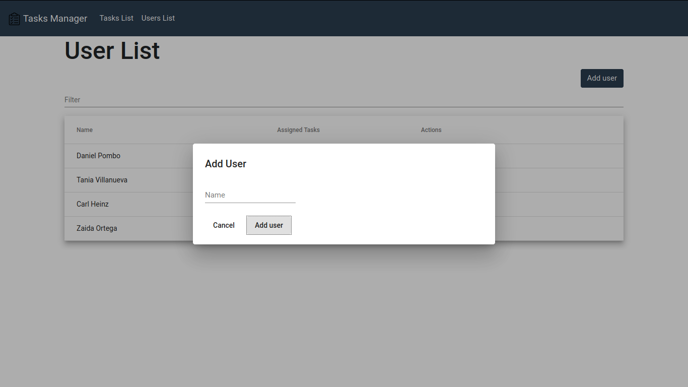
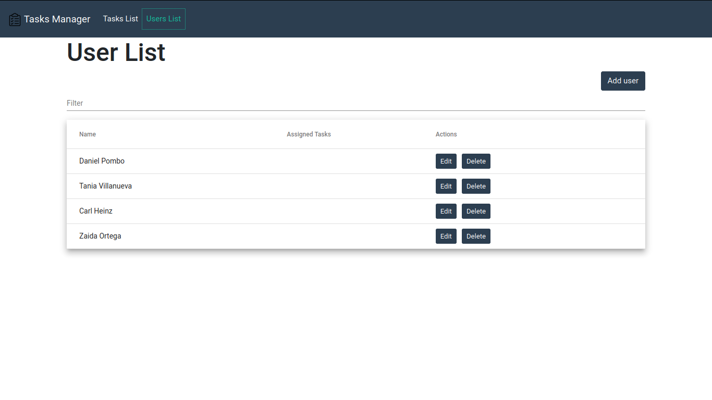

## Tasks Manager

  



  

## Table of contents

*  [General info](#general-info)

*  [Features](#features)

*  [Technologies](#technologies)

*  [Setup](#setup)

*  [Server](#server)

*  [Web Client](#webclient)

  

## General info

Tasks Manager is a WebApp to create,edit and delete tasks, you can set different task status and assign task to a user. This project was developed using the MEAN stack.

  

## Features

  

* Create Task



* Edit Task



* Tasks List



* Filter a Task of the list

* Add User



* Assign a Task to a User

* Remove a User from a Task

* User List



* Change status in a Task(Open,In-Progress,Completed,Archived)

  

## Technologies

Project is created with:

* Node.js version: 10.16.3

* NPM version: 6.10.1

* Angular version: 8.3.0

* Mongo DB: 4.0.12

## Setup

To run this project, install it locally using npm:

```
$ git clone https://github.com/pombodaniel10/tasks-manager

$ cd tasks-manager

$ cp .env.example .env

$ npm install

$ npm run start
```
 

## Server


### Tasks API

##### Task Schema

```javascript
{
	name: String,
	description: String,
	assignedTo: String,
	status: String,
	date: Date
}
``` 

##### Add a task

```http
POST /tasks/add
```

##### Edit a task by id

```http
PUT /tasks/edit/:id
```

##### Get a task by id

```http
GET /tasks/:id
```

##### Get all tasks

```http
GET /tasks/getAll
```

##### Delete a task by id

```http
DELETE /tasks/delete/:id
```

##### User Schema

```javascript
{
	name: String,
	assignedTasks: String[],
}
``` 

##### Add a user

```http
POST /users/add/
```

##### Get all users

```http
GET /users/getAll/
```