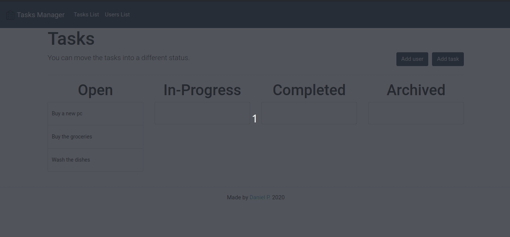
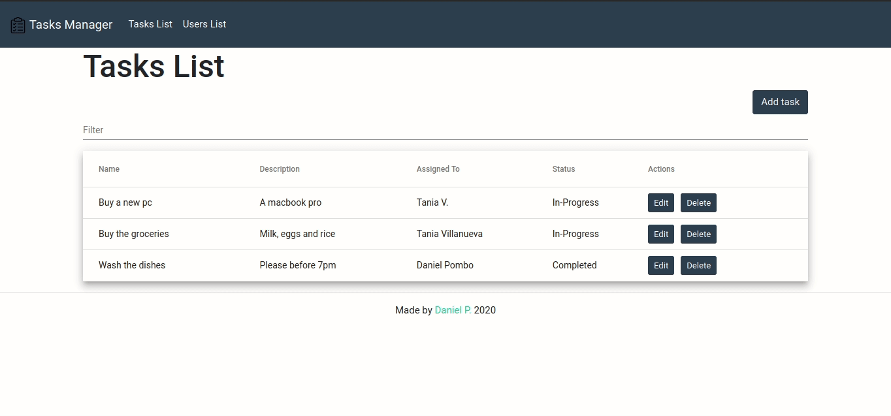
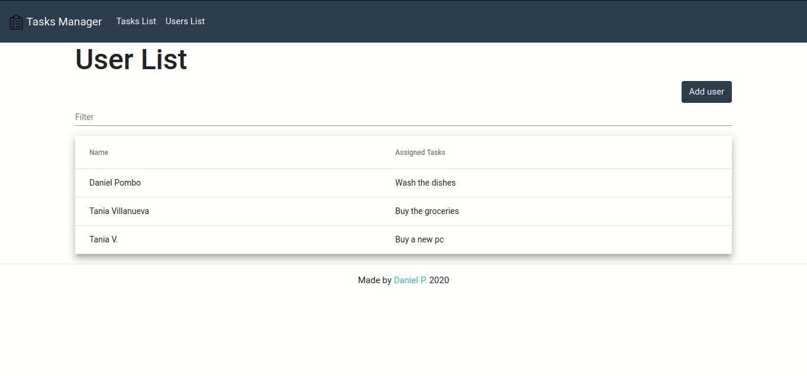

# Tasks Manager

### [Deployment WebSite](http://semard.com.co:4016)



## Table of contents

*  [General info](#general-info)

*  [Features](#features)

*  [Technologies](#technologies)

*  [Setup](#setup)

*  [Documentation](#documentation)
	* [Server](#server)
	*  [Web Client](#webclient)

  

## General info

Tasks Manager is a Responsive WebApp to create,edit and delete tasks, you can set different task status and assign task to a user. This project was developed using the MEAN stack. The server was deployed to a private vps using Docker.

## Features

* **Create/Edit Task**


* **Tasks List**
* **Filter a Task of the list**


* **Assign a Task to a User**
* **Remove a User from a Task**
* **Change status in a Task(Open,In-Progress,Completed,Archived)**


* **Add User**
* **Users List**



  

## Technologies

Project is created with:

* Node.js version: 10.16.3

* NPM version: 6.10.1

* Angular version: 8.3.0

* Mongo DB: 4.0.12

## Setup

### NPM Install 

To run this project, install it locally using npm:

```
$ git clone https://github.com/pombodaniel10/tasks-manager

$ cd tasks-manager

$ cp .env.example .env

$ npm install

$ npm run start
```

### Docker Install 

Modify the 'MONGO HOST' into the .env file to ```MONGO_HOST=mongodb://mongodb:27017/tasks-manager```

```
$ git clone https://github.com/pombodaniel10/tasks-manager

$ cd tasks-manager

$ cp .env.example .env

$ docker-compose build

$ docker-compose up -d
```
 
## Documentation

## Server

## **Tasks API**

### Task Schema

```javascript
{
	name: String,
	description: String,
	assignedTo: String,
	status: String,
	date: Date
}
``` 

### **Add a task**
----
*  **URL Params**
	
	None

* **Data Params**

	**Required:**
	`name: string`
	`description: string`

	**Optional:**

	`assignedTo: string`

```http
POST /tasks/add
```

### **Edit a task by id**
----
*  **URL Params**

	`id: string`

* **Data Params**

	**Required:**
	`name: string`
	`description: string`
	`assignedTo: string`
	`status: string`

```http
PUT /tasks/edit/:id
```

### **Get a task by id**
----
*  **URL Params**

	`id: string`

* **Data Params**

	None

```http
GET /tasks/:id
```

### **Get all tasks**
----
*  **URL Params**

	None

* **Data Params**

	None

```http
GET /tasks/getAll
```

### **Delete a task by id**
----
*  **URL Params**

	`id: string`

* **Data Params**

	None

```http
DELETE /tasks/delete/:id
```

## Users API

### **User Schema**

```javascript
{
	name: String,
	assignedTasks: String[],
}
``` 

### **Add a user**
----
*  **URL Params**

	None

* **Data Params**

	`name: string`

```http
POST /users/add/
```

### **Delete a user by id**
----
*  **URL Params**

	`id: string`

* **Data Params**

	None

```http
DELETE /users/delete/:id
```

### **Get all users**
----
*  **URL Params**

	None

* **Data Params**

	None

```http
GET /users/getAll/
```

## Web Client

* Angular Framework for Client Web.
* Angular Material Components.
* Bootswatch's Flatly Bootstrap theme.
